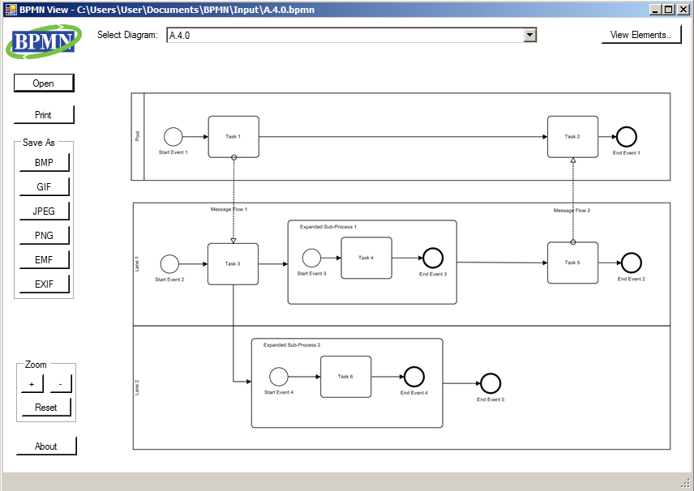

[](https://ci.appveyor.com/project/bzinchenko/bpmnview)
[](https://opensource.org/licenses/MIT) [](https://app.fossa.io/projects/git%2Bgithub.com%2Fbzinchenko%2Fbpmnview?ref=badge_shield)

# BPMN View
A simple free tool to view and print business process diagrams in a popular BPMN format. 

* Full conformance to the latest version of [BPMN 2.0 specification by OMG](http://www.bpmn.org/).
* Import models from all [major BPM vendors](http://bpmn-miwg.github.io/bpmn-miwg-tools/)
* Strict validation of the model according to BPMN specification.
* Arbitrary scaling and zooming view of most complex diagrams.
* Support of raster and vector image output.
* Batch processing of multiple BPMN files.
* 100% Microsoft .NET managed solution.
* Loyal open source license for private and commercial use.
 
Try it yourself!
* Download one-click [setup for Windows](https://github.com/bzinchenko/bpmnview/blob/master/Setup/BPMNView_Setup.zip).
* Download pre-built [binary package](https://github.com/bzinchenko/bpmnview/blob/master/Setup/BPMNView_Sources.zip).
* Clone project repository and build it with Microsoft Visual Studio.
* Test it on files from [offcial BPMN test suite](https://github.com/bpmn-miwg/bpmn-miwg-test-suite).
* Build your own open source or commercial solution based on this code.

 


##Code example
Jump start your BPMN capable solution in minutes!

Sample code to read BPMN file and save it as an image:

```csharp
Model model = BPMN.Model.Read("B.2.0.bpmn");
Image img = model.GetImage(0, 2.0f);
img.Save("B.2.0.png", ImageFormat.Png);
```

Below is the result:


BPMN View was created with support from [CaseAgile LLC](http://caseagile.com/), an innovative software and business service company specializing in integration of platforms and environments for enterprise modeling. Find more on official company page: [http://caseagile.com/](http://caseagile.com/)


## License
[](https://app.fossa.io/projects/git%2Bgithub.com%2Fbzinchenko%2Fbpmnview?ref=badge_large)