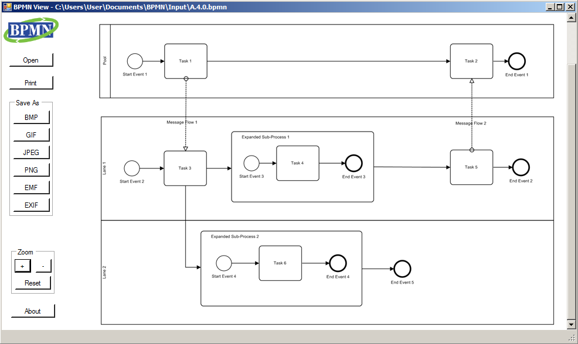

[](https://www.nuget.org/packages/BPMN.Sharp/)
[](https://www.nuget.org/packages/BPMN.Sharp/)
[](https://www.omg.org/spec/BPMN/2.0.2/PDF)
[](https://github.com/bzinchenko/bpmnview/stargazers)
[](https://ci.appveyor.com/project/bzinchenko/bpmnview)
[](https://github.com/bzinchenko/bpmnview/actions/workflows/build.yml)
[](https://opensource.org/licenses/MIT)
[](https://app.fossa.io/projects/git%2Bgithub.com%2Fbzinchenko%2Fbpmnview?ref=badge_shield)

# BPMN View

A free, open source tool to view, print and programmatically create and edit business process diagrams in the [BPMN 2.0](https://www.omg.org/spec/BPMN/2.0.2/PDF) format.

[](Images/BPMN_View.png)

---

## Features

- Full conformance to the [BPMN 2.0.2 specification by OMG](https://www.omg.org/spec/BPMN/2.0.2/PDF)
- Imports models from all [major BPM vendors](http://bpmn-miwg.github.io/bpmn-miwg-tools/)
- Validated against the official [BPMN MIWG test suite](https://github.com/bpmn-miwg/bpmn-miwg-test-suite)
- Arbitrary scaling and zooming of complex diagrams
- Raster (PNG, BMP) and vector image output
- Batch processing of multiple BPMN files
- Programmatic API to create, edit and normalise BPMN models ([BPMN.Sharp NuGet](https://www.nuget.org/packages/BPMN.Sharp/))
- 100% Microsoft .NET managed solution
- MIT licence — free for private and commercial use

---

## Getting Started

### Option 1 — Use the desktop viewer

- Download the one-click [setup for Windows](Setup/BPMNView_Setup.zip)
- Download the pre-built [binary package](Setup/BPMNView_Sources.zip)
- Or clone this repository and build with Visual Studio

### Option 2 — Use the NuGet package in your own project

```bash
dotnet add package BPMN.Sharp
```

```powershell
# Visual Studio Package Manager Console
Install-Package BPMN.Sharp
```

---

## Reading and Rendering a BPMN File

Read any BPMN 2.0 file and save it as a PNG image in three lines:

```csharp
using BPMN;
using System.Drawing.Imaging;

Model model = Model.Read("B.2.0.bpmn");
Image img = model.GetImage(0, 2.0f);
img.Save("B.2.0.png", ImageFormat.Png);
```

Result:

[](Images/B.2.0.png)

---

## Creating a BPMN Model Programmatically

The `Editor` class provides a complete API for creating and modifying BPMN 2.0 models. Every method maps directly to elements defined in the BPMN 2.0.2 specification.

```csharp
using BPMN;
using System.Collections.Generic;
using System.Drawing;

Editor editor = new Editor();
editor.Create("My Process", "Author");

// Semantic layer — add process elements, each returning an auto-generated ID
string start = editor.AddEvent(null, null, "Start Event",
    EventType.Start, EventTrigger.None, EventRole.None);
string task1 = editor.AddActivity(null, "Task 1",
    ActivityType.Task, ActivityMarker.None, TaskType.User, null);
string task2 = editor.AddActivity(null, "Task 2",
    ActivityType.Task, ActivityMarker.None, TaskType.Manual, null);
string task3 = editor.AddActivity(null, "Task 3",
    ActivityType.Task, ActivityMarker.None, TaskType.Service, null);
string end = editor.AddEvent(null, null, "End Event",
    EventType.End, EventTrigger.None, EventRole.None);

string f1 = editor.AddFlow(null, null, start, task1, null, FlowType.Sequence, null, false, FlowDirection.None);
string f2 = editor.AddFlow(null, null, task1, task2, null, FlowType.Sequence, null, false, FlowDirection.None);
string f3 = editor.AddFlow(null, null, task2, task3, null, FlowType.Sequence, null, false, FlowDirection.None);
string f4 = editor.AddFlow(null, null, task3, end,   null, FlowType.Sequence, null, false, FlowDirection.None);

// Diagram layer — add visual positions (Shape.Bounds uses integer Rectangle)
string diag = editor.AddDiagram("Diagram 1", 96f);

Shape shape = new Shape();
shape.Bounds = new List<Rectangle>();

shape.ElementRef = start;
shape.Bounds = new List<Rectangle> { new Rectangle(10, 10, 30, 30) };
editor.AddShape(diag, shape);

shape.ElementRef = task1;
shape.Bounds = new List<Rectangle> { new Rectangle(70, 10, 70, 30) };
editor.AddShape(diag, shape);

shape.ElementRef = task2;
shape.Bounds = new List<Rectangle> { new Rectangle(170, 10, 70, 30) };
editor.AddShape(diag, shape);

shape.ElementRef = task3;
shape.Bounds = new List<Rectangle> { new Rectangle(270, 10, 70, 30) };
editor.AddShape(diag, shape);

shape.ElementRef = end;
shape.Bounds = new List<Rectangle> { new Rectangle(370, 10, 30, 30) };
editor.AddShape(diag, shape);

Edge edge = new Edge();
edge.Points = new List<Point> { new Point(40, 25), new Point(70, 25) };
edge.ElementRef = f1; editor.AddEdge(diag, edge);

edge.Points = new List<Point> { new Point(140, 25), new Point(170, 25) };
edge.ElementRef = f2; editor.AddEdge(diag, edge);

edge.Points = new List<Point> { new Point(240, 25), new Point(270, 25) };
edge.ElementRef = f3; editor.AddEdge(diag, edge);

edge.Points = new List<Point> { new Point(340, 25), new Point(370, 25) };
edge.ElementRef = f4; editor.AddEdge(diag, edge);

editor.Save("MyProcess.bpmn");
```

Result:

[](Images/TestModel.png)

---

## API Documentation

Complete documentation for the `Editor` class is in the [`Docs`](Docs/) folder:

| Article | Topics |
|---------|--------|
| [01 – Getting Started](Docs/01-getting-started.md) | `Create`, `Load`, `Parse`, `Save`, `Serialize`, `Refresh`, `Normalize` |
| [02 – Events](Docs/02-events.md) | `AddEvent` — all types, triggers and roles |
| [03 – Activities](Docs/03-activities.md) | `AddActivity` — tasks, sub-processes, markers |
| [04 – Gateways](Docs/04-gateways.md) | `AddGateway` — all five gateway types |
| [05 – Flows](Docs/05-flows.md) | `AddFlow` — sequence, message, association, conditional, default |
| [06 – Pools and Lanes](Docs/06-pools-lanes.md) | `AddCollaboration`, `AddProcess`, `AddPool`, `AddLane`, `AddToLane` |
| [07 – Data and Artifacts](Docs/07-data-artifacts.md) | `AddAnnotation`, `AddDataObject`, `AddDataStore`, `AddGroup`, `AddMessage` |
| [08 – Diagram Layout](Docs/08-diagram-layout.md) | `AddDiagram`, `AddShape`, `AddEdge`, labels, waypoints, positions |
| [09 – Element Manipulation](Docs/09-element-manipulation.md) | `CountElements`, `UpdateElement`, `RemoveElement` |
| [10 – Complete Examples](Docs/10-examples.md) | Full MIWG-aligned examples A.1.0 through C series |

---

## Code Examples

The [`Examples`](Examples/) folder contains a ready-to-run Visual Studio solution targeting .NET Framework 4.7.2. It demonstrates every `Editor` method with realistic, complete BPMN models based on the official [BPMN MIWG reference test suite](https://github.com/bpmn-miwg/bpmn-miwg-test-suite).

| File | BPMN Concepts | MIWG Reference |
|------|--------------|----------------|
| `GettingStarted.cs` | Create, Load, Save, Normalize, Parse, Serialize | A.1.0 |
| `Events.cs` | All event types, triggers and boundary events | A.2.0, A.4.1 |
| `Activities.cs` | Tasks, sub-processes, loop, compensation | A.3.0, C.1.0 |
| `Gateways.cs` | Exclusive, Inclusive, Parallel, Event-Based | A.4.0, C.6.0 |
| `Flows.cs` | Sequence, Message, Association flows | B.1.0 |
| `PoolsAndLanes.cs` | Collaboration, pools, lanes | B.2.0 |
| `DataAndArtifacts.cs` | Data objects, annotations, groups, messages | C.2.0 |
| `DiagramLayout.cs` | Shapes, edges, labels, waypoints | C.3.0 |
| `ElementManipulation.cs` | Update, remove and count elements | — |

Build and run the solution — all examples write `.bpmn` and `.png` files to the `Output/` folder.

---

## BPMN MIWG

This project is maintained by a member of the [BPMN Model Interchange Working Group (BPMN MIWG)](http://bpmn-miwg.github.io/bpmn-miwg-tools/) at the OMG, active since its foundation in 2013. The MIWG reference test suite is used as the authoritative source of BPMN 2.0 conformance models throughout this project's documentation and examples.

---

## About

BPMN View was created with support from [CaseAgile LLC](http://caseagile.com/), specialising in integration of platforms and environments for enterprise modeling.

---

## License

MIT — free for private and commercial use.

[](https://app.fossa.io/projects/git%2Bgithub.com%2Fbzinchenko%2Fbpmnview?ref=badge_large)
